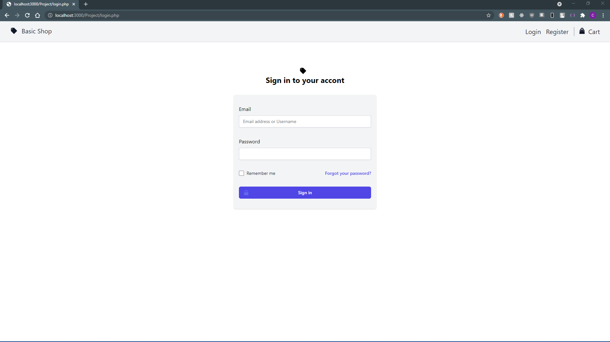

# Project Name: Simple Shop

## Project Summary: This project will create a simple e-commerce site for users. Administrators or store owners will be able to manage inventory and users will be able to manage their cart and place orders

## Github Link: [Production Branch](https://github.com/cjdomacena/IT202-003/tree/production)

## Project Board Link: [Project Board](https://github.com/cjdomacena/IT202-003/projects/1)

## Website Link: [Heroku Prod](https://cd395-prod.herokuapp.com/Project/login.php)

## Your Name: Christian Domacena

<!--
### Line item / Feature template (use this for each bullet point)
#### Don't delete this

- [ ] \(mm/dd/yyyy of completion) Feature Title (from the proposal bullet point, if it's a sub-point indent it properly)
  -  List of Evidence of Feature Completion
    - Status: Pending (Completed, Partially working, Incomplete, Pending)
    - Direct Link: (Direct link to the file or files in heroku prod for quick testing (even if it's a protected page))
    - Pull Requests
      - PR link #1 (repeat as necessary)
    - Screenshots
      - Screenshot #1 (paste the image so it uploads to github) (repeat as necessary)
        - Screenshot #1 description explaining what you're trying to show
### End Line item / Feature Template
-->

### Proposal Checklist and Evidence

<strong>Milestone 1</strong>

- [x] Milestone 1

  - [x] (10/18/2021) User will be able to register a new account

    - List of Evidence of Feature Completion

      - Status: (Incomplete)(It wipes the email and username when email/username is taken upon submission)

      - [Initial register.php from slides](https://github.com/cjdomacena/IT202-003/pull/34/commits/8a36c500b63f27a9a4a168e08ebc939496fb31cc#diff-a6efd6bcdcc38b7d158885263301aac736d98718cecbb4d34a946211a9a655ae)
      - [Direct link to file (Most recent)](https://github.com/cjdomacena/IT202-003/blob/production/public_html/Project/register.php)

    - Pull Request/s

      - [Pull Request #34](https://github.com/cjdomacena/IT202-003/pull/34/commits/8a36c500b63f27a9a4a168e08ebc939496fb31cc#diff-a6efd6bcdcc38b7d158885263301aac736d98718cecbb4d34a946211a9a655ae)

      - [Pull Request #67](https://github.com/cjdomacena/IT202-003/pull/67)

        - (11/11/2021) some flash parameters to be updated using tailwind.

    - Screenshots

      - Register form with styling.

        - 

      - Register with password errors

        - Passwords match, but does not meet the requirements

          - 

        - Password meet requirements, but does not match

          - 

        - Password does not meet requirements and does not match

          - 

      - Register with Email errors

        - Email already taken (It wipes the form)

          - 

      - Register with username errors

        - Username is already taken (It wipes the form)

          -

  - [x] (10/11/2021) User will be able to login to their account (given they enter the correct credentials)

    - List of Evidence of Feature Completion

      - Status: (Complete)

      - [Direct link to file (Most recent)](https://github.com/cjdomacena/IT202-003/blob/production/public_html/Project/login.php)

    - Pull Request/s

      - [Pull Request 60 (Most recent)](https://github.com/cjdomacena/IT202-003/pull/60)

        - Added additional validation using js

      - [Direct link to Commit (PR #39)](https://github.com/cjdomacena/IT202-003/pull/39/commits/c7356a461b085c0aa72afca72e0371ac5608bdad)

        - It got mixed up with my other commits

    - Screenshots

      - Login Form

        - .

          - Basic login form.

      - User will be able to login with correct credentials (Using username)

        - 

        - User logs in using username and will be redirected to home.php.

      - User will be able to login with correct credentials (Using email)

        - 

        - User logs in using email and will be redirected to home.php.

      - Login Validation

        - Invalid email (does not exist)

          - 

          - Displays flash when email does not exists.

        - Invalid password

          - 

          - Displays flash when password is incorrect.

      - Stores session upon successful login

        - 

        - Displays a welcome message using flash with the user's username

        - Displays role

  - [x] (10/18/2021) User will be able to logout

    - List of Evidence of Feature Completion

      - Status: (Incomplete)

        - Flash message doesn't appear when loggin out.

      - Direct Link (https://github.com/cjdomacena/IT202-003/blob/production/public_html/Project/logout.php)

    - Pull Request/s

      - [Pull Request #34](https://github.com/cjdomacena/IT202-003/pull/34/)

        - Fell behind about a week, this PR is to get all my Project files updated based on class slides.

      - [Direct link to commit (PR #34)](https://github.com/cjdomacena/IT202-003/pull/34/commits/7a2d6ff17f145627ffdf276595e30be87954fa80)

        - Direct link because I did give the commit a proper name to its appropriate change.

    - Screenshots

      - User will be able to logout

        - 

        - Flash message does not appear upon logging out.

      - Session is destroyed upon logging out

        - 

        - After logging out, user will not be able to go back.

    - [x] (25/10/2021) Basic security rules implemented

    - List of Evidence of Feature Completion

      - Status: (Completed)

      - [Nav partials](https://github.com/cjdomacena/IT202-003/blob/production/partials/nav.php)

        - Displays different navigation based on user role.

      - Pull Request/s

        - Nav (Show different nav items based on user role)

        - [Pull Request #38](https://github.com/cjdomacena/IT202-003/pull/38/commits/484ec69acaeb1e30dd08b50c3ba5f690828e2857)

          - This was the initial PR.

          - Was behind about a week and updated nav to catch up based on slides.

    - Screenshots

      - Authentication

        - User with no role (In this case, admin role is disabled for this user)

          - 

          - Only shows appropriate navigation items based on user role.

        - User is not able to access specific pages based on User's role

          - 

          - User will be redirected to home when tried to access, in this case, create_role.php

      - Roles table

        - See below.

    - [x] (25/10/2021) Basic Roles implemented

      - List of Evidence of Feature Completion

        - Status: (Completed)

        - [sql folder](https://github.com/cjdomacena/IT202-003/tree/production/public_html/Project/sql)

      - Pull Request/s

        - [Pull Request #37](https://github.com/cjdomacena/IT202-003/pull/37)

      - Screenshots

        - Users table

        - 

        - Displays users table.

        - Roles table

          - 

          - Current roles table

        - User Roles table

          - 

          - Pivot table between Roles and Users table (Not sure if its called pivot table)

    - [x] (11/11/2021 with everything styled) Site should have basic styles/theme applied; everything should be styled

      - List of Evidence of Feature Completion

        - Navbar in local env

          

        - Status: (In progress)

        - [Link to file](https://github.com/cjdomacena/IT202-003/blob/Milestone1/partials/nav.php)

      - Pull Request/s

        - [Navbar / PR #39](https://github.com/cjdomacena/IT202-003/pull/39/commits/2dbeddaee0bec252c154cc5f225ba135dc4381e3)

          - [Dropdown Menu](https://github.com/cjdomacena/IT202-003/pull/55)

        - [List Roles PR#58](https://github.com/cjdomacena/IT202-003/pull/58)

          - [Link to file](https://github.com/cjdomacena/IT202-003/blob/production/public_html/Project/admin/list_roles.php)

        - [Assign Roles PR#64](https://github.com/cjdomacena/IT202-003/pull/64/commits/1c3ca08dc47416db7da84cd8312176734f8e6d65)

          - [Link to file](https://github.com/cjdomacena/IT202-003/blob/production/public_html/Project/admin/assign_roles.php)

        - [Create Roles PR#51](https://github.com/cjdomacena/IT202-003/pull/51)

          - [Link to file](https://github.com/cjdomacena/IT202-003/blob/production/public_html/Project/admin/create_role.php)

        - [Registration & Log in PR#46](https://github.com/cjdomacena/IT202-003/pull/46)

          - [Link to file (Register)](https://github.com/cjdomacena/IT202-003/blob/production/public_html/Project/register.php)

          - [Link to file(Login)](https://github.com/cjdomacena/IT202-003/blob/production/public_html/Project/login.php)

        - [Profile Edits (Edit Profile, Reset Password, View Profile)](https://github.com/cjdomacena/IT202-003/pull/62)

          - [Link to file (Edit Profile)](https://github.com/cjdomacena/IT202-003/blob/development/public_html/Project/profile.php)

          - [Link to file(Reset Password)](https://github.com/cjdomacena/IT202-003/blob/development/public_html/Project/account/reset_password.php)

          - [Link to file(View Profile)](https://github.com/cjdomacena/IT202-003/blob/development/public_html/Project/account/view_profile.php)

      - Screenshots

        - Homepage (index.php)

          - 

          - Displays a simple welcome hero message.

        - Login page

          - 

          - Login form

        - Registration page

          - 

          - Registration form

        - Homepage for logged in users (home.php) (role = admin)

          - 

          - Displays a welcome message.

        - Edit profile (profile.php)

          - 

          - Only shows input for email and username

        - Reset password (reset_password.php)

          - 

          - Shows email and username inputs, but user won't be able to edit them.

          - Make users able to reset their password.

        - View Profile (view_profile.php)

          - 

          - Shows disabled inputs for username and email

        - Create Role

          - 

          - Inputs for creating roles

        - List Roles

          - 

          - Displays a table of roles

        - Assign Roles

          - 

          - This is the default view

          - 

          - View with all the users

    - [x] (11/10/2021) Any output messages/errors should be “user friendly”

      - List of Evidence of Feature Completion

        - Status: (Completed)

        - [Registration](https://github.com/cjdomacena/IT202-003/blob/production/public_html/Project/register.php)

        - [Login](https://github.com/cjdomacena/IT202-003/blob/production/public_html/Project/login.php)

      - Pull Request/s

        - [Pull Request #33](https://github.com/cjdomacena/IT202-003/pull/33)

          - Flash based on slides

          - There's more changes to flash throughout the project, but I failed to keep track of them upon changing to tailwind

      - Screenshots

        - Login errors

          - 

          - Display user friendly errors

        - Registration Errors (JS Validation)

          - 

          - Flash using helper.js

        - Registration Erros (PHP validation)

          - Register with password errors

            - Passwords match, but does not meet the requirements

              - 

            - Password meet requirements, but does not match

              - 

            - Password does not meet requirements and does not match

              - 

          - Register with Email errors

            - Email already taken (It wipes the form)

              - 

          - Register with username errors

            - Username is already taken (It wipes the form)

              -

        - Reset Password (JS Validation)

          - 

            - Password does not match and does not meet requirements

        - Reset Password (PHP validation)

          - 

          - New password and confirm password match and meet requirements, but current password is incorrect.

        - List Roles

          - 

          - When filtering displays a flash message.

        - Assign Roles

          - 

          - Shows warning message when searching and username field is empty.

    - [x] (11/11/2021 of completion) User will be able to see their profile

      - List of Evidence of Feature Completion

        - Status: (Completed)

        - [Link to file](https://github.com/cjdomacena/IT202-003/blob/production/public_html/Project/account/view_profile.php)

      - Pull Request/s

        - [Pull Request #62](https://github.com/cjdomacena/IT202-003/pull/62)

          - [Link to specific commit](https://github.com/cjdomacena/IT202-003/pull/62/commits/4979bfa251e65cd7f8b2029bde9224cb368f1669)

      - Screenshots

        - 

        - Only shows email and username (for now)

    - [x] (11/11/2021) User will be able to edit their profile

      - List of Evidence of Feature Completion

        - Status: (Complete)

        - [Link to file (Edit Profile)](https://github.com/cjdomacena/IT202-003/blob/development/public_html/Project/profile.php)

        - [Link to file(Reset Password)](https://github.com/cjdomacena/IT202-003/blob/development/public_html/Project/account/reset_password.php)
        - [Link to file(View Profile)](https://github.com/cjdomacena/IT202-003/blob/development/public_html/Project/account/view_profile.php)

      - Pull Request/s

        - [Profile Edits (Edit Profile, Reset Password, View Profile) PR #62](https://github.com/cjdomacena/IT202-003/pull/62)

      - Screenshots

        - Edit Profile

          - Success

            - 

              - Displays success upon successful update of username.

            - 

              - Displays success upon successful update of email.

          - Errors

            - 

              - Displays an error when email is taken.

            - 

              - Displays an error when username is taken.

        - Reset Password

          - Success

            - 

              - Displays success message upon successful password reset/change

          - Errors

            - Reset Password (JS Validation)

              - 

                - Password does not match and does not meet requirements

            - Reset Password (PHP validation)

              - 

              - New password and confirm password match and meet requirements, but current password is incorrect.

        - View Profile

          - 

            - Displays profile info

  

<strong>Milestone 2</strong>

- [ ] \(mm/dd/yyyy of completion) User with an admin role or shop owner role will be able to add products to inventory
  - List of Evidence of Feature Completion
  - Status: Pending (Completed, Partially working, Incomplete, Pending)
  - Direct Link: (Direct link to the file or files in heroku prod for quick testing (even if it's a protected page))
  - Pull Requests
    - PR link #1 (repeat as necessary)
  - Screenshots
    - Screenshot #1 (paste the image so it uploads to github) (repeat as necessary)
      - Screenshot #1 description explaining what you're trying to show
- [ ] \(mm/dd/yyyy of completion) Any user will be able to see products with visibility = true on the Shop page

  - List of Evidence of Feature Completion
  - Status: Pending (Completed, Partially working, Incomplete, Pending)
  - Direct Link: (Direct link to the file or files in heroku prod for quick testing (even if it's a protected page))
  - Pull Requests
    - PR link #1 (repeat as necessary)
  - Screenshots
    - Screenshot #1 (paste the image so it uploads to github) (repeat as necessary)
      - Screenshot #1 description explaining what you're trying to show

- [ ] \(mm/dd/yyyy of completion) Admin/Shop owner will be able to see products with any visibility
  - List of Evidence of Feature Completion
  - Status: Pending (Completed, Partially working, Incomplete, Pending)
  - Direct Link: (Direct link to the file or files in heroku prod for quick testing (even if it's a protected page))
  - Pull Requests
    - PR link #1 (repeat as necessary)
  - Screenshots
    - Screenshot #1 (paste the image so it uploads to github) (repeat as necessary)
      - Screenshot #1 description explaining what you're trying to show
- [ ] \(mm/dd/yyyy of completion) Admin/Shop owner will be able to see products with any visibility

  - List of Evidence of Feature Completion
  - Status: Pending (Completed, Partially working, Incomplete, Pending)
  - Direct Link: (Direct link to the file or files in heroku prod for quick testing (even if it's a protected page))
  - Pull Requests
    - PR link #1 (repeat as necessary)
  - Screenshots
    - Screenshot #1 (paste the image so it uploads to github) (repeat as necessary)
      - Screenshot #1 description explaining what you're trying to show

- [ ] \(mm/dd/yyyy of completion) Admin/Shop owner will be able to edit any product

  - List of Evidence of Feature Completion
  - Status: Pending (Completed, Partially working, Incomplete, Pending)
  - Direct Link: (Direct link to the file or files in heroku prod for quick testing (even if it's a protected page))
  - Pull Requests
    - PR link #1 (repeat as necessary)
  - Screenshots
    - Screenshot #1 (paste the image so it uploads to github) (repeat as necessary)
      - Screenshot #1 description explaining what you're trying to show

- [ ] \(mm/dd/yyyy of completion) User will be able to click an item from a list and view a full page with more info about the item (Product Details Page)
  - List of Evidence of Feature Completion
  - Status: Pending (Completed, Partially working, Incomplete, Pending)
  - Direct Link: (Direct link to the file or files in heroku prod for quick testing (even if it's a protected page))
  - Pull Requests
    - PR link #1 (repeat as necessary)
  - Screenshots
    - Screenshot #1 (paste the image so it uploads to github) (repeat as necessary)
      - Screenshot #1 description explaining what you're trying to show
- [ ] \(mm/dd/yyyy of completion) User must be logged in for any Cart related activity below

  - List of Evidence of Feature Completion
  - Status: Pending (Completed, Partially working, Incomplete, Pending)
  - Direct Link: (Direct link to the file or files in heroku prod for quick testing (even if it's a protected page))
  - Pull Requests
    - PR link #1 (repeat as necessary)
  - Screenshots
    - Screenshot #1 (paste the image so it uploads to github) (repeat as necessary)
      - Screenshot #1 description explaining what you're trying to show

- [ ] \(mm/dd/yyyy of completion) User will be able to add items to Cart
  - List of Evidence of Feature Completion
  - Status: Pending (Completed, Partially working, Incomplete, Pending)
  - Direct Link: (Direct link to the file or files in heroku prod for quick testing (even if it's a protected page))
  - Pull Requests
    - PR link #1 (repeat as necessary)
  - Screenshots
    - Screenshot #1 (paste the image so it uploads to github) (repeat as necessary)
      - Screenshot #1 description explaining what you're trying to show
- [ ] \(mm/dd/yyyy of completion) User will be able to see their cart

  - List of Evidence of Feature Completion
  - Status: Pending (Completed, Partially working, Incomplete, Pending)
  - Direct Link: (Direct link to the file or files in heroku prod for quick testing (even if it's a protected page))
  - Pull Requests
    - PR link #1 (repeat as necessary)
  - Screenshots
    - Screenshot #1 (paste the image so it uploads to github) (repeat as necessary)
      - Screenshot #1 description explaining what you're trying to show

- [ ] \(mm/dd/yyyy of completion) User will be able to change quantity of items in their cart
  - List of Evidence of Feature Completion
  - Status: Pending (Completed, Partially working, Incomplete, Pending)
  - Direct Link: (Direct link to the file or files in heroku prod for quick testing (even if it's a protected page))
  - Pull Requests
    - PR link #1 (repeat as necessary)
  - Screenshots
    - Screenshot #1 (paste the image so it uploads to github) (repeat as necessary)
      - Screenshot #1 description explaining what you're trying to show
- [ ] \(mm/dd/yyyy of completion) User will be able to remove a single item from their cart via button click
  - List of Evidence of Feature Completion
  - Status: Pending (Completed, Partially working, Incomplete, Pending)
  - Direct Link: (Direct link to the file or files in heroku prod for quick testing (even if it's a protected page))
  - Pull Requests
    - PR link #1 (repeat as necessary)
  - Screenshots
    - Screenshot #1 (paste the image so it uploads to github) (repeat as necessary)
      - Screenshot #1 description explaining what you're trying to show
- [ ] \(mm/dd/yyyy of completion) User will be able to clear their entire cart via a button click

  - List of Evidence of Feature Completion
  - Status: Pending (Completed, Partially working, Incomplete, Pending)
  - Direct Link: (Direct link to the file or files in heroku prod for quick testing (even if it's a protected page))
  - Pull Requests
    - PR link #1 (repeat as necessary)
  - Screenshots - Screenshot #1 (paste the image so it uploads to github) (repeat as necessary) - Screenshot #1 description explaining what you're trying to show
  

- Milestone 3
- [ ] \(mm/dd/yyyy of completion) User will be able to purchase items in their Cart
  - List of Evidence of Feature Completion
  - Status: Pending (Completed, Partially working, Incomplete, Pending)
  - Direct Link: (Direct link to the file or files in heroku prod for quick testing (even if it's a protected page))
  - Pull Requests
    - PR link #1 (repeat as necessary)
  - Screenshots
    - Screenshot #1 (paste the image so it uploads to github) (repeat as necessary)
      - Screenshot #1 description explaining what you're trying to show
- [ ] \(mm/dd/yyyy of completion) Order Confirmation Page

  - List of Evidence of Feature Completion
  - Status: Pending (Completed, Partially working, Incomplete, Pending)
  - Direct Link: (Direct link to the file or files in heroku prod for quick testing (even if it's a protected page))
  - Pull Requests
    - PR link #1 (repeat as necessary)
  - Screenshots
    - Screenshot #1 (paste the image so it uploads to github) (repeat as necessary)
      - Screenshot #1 description explaining what you're trying to show

- [ ] \(mm/dd/yyyy of completion) User will be able to see their Purchase History
  - List of Evidence of Feature Completion
  - Status: Pending (Completed, Partially working, Incomplete, Pending)
  - Direct Link: (Direct link to the file or files in heroku prod for quick testing (even if it's a protected page))
  - Pull Requests
    - PR link #1 (repeat as necessary)
  - Screenshots
    - Screenshot #1 (paste the image so it uploads to github) (repeat as necessary)
      - Screenshot #1 description explaining what you're trying to show
- [ ] \(mm/dd/yyyy of completion) Store Owner will be able to see all Purchase History

  - List of Evidence of Feature Completion
  - Status: Pending (Completed, Partially working, Incomplete, Pending)
  - Direct Link: (Direct link to the file or files in heroku prod for quick testing (even if it's a protected page))
  - Pull Requests
    - PR link #1 (repeat as necessary)
  - Screenshots
    - Screenshot #1 (paste the image so it uploads to github) (repeat as necessary)
      - Screenshot #1 description explaining what you're trying to show

- Milestone 4

### Intructions

#### Don't delete this

1. Pick one project type
2. Create a proposal.md file in the root of your project directory of your GitHub repository
3. Copy the contents of the Google Doc into this readme file
4. Convert the list items to markdown checkboxes (apply any other markdown for organizational purposes)
5. Create a new Project Board on GitHub
   - Choose the Automated Kanban Board Template
   - For each major line item (or sub line item if applicable) create a GitHub issue
   - The title should be the line item text
   - The first comment should be the acceptance criteria (i.e., what you need to accomplish for it to be "complete")
   - Leave these in "to do" status until you start working on them
   - Assign each issue to your Project Board (the right-side panel)
   - Assign each issue to yourself (the right-side panel)
6. As you work
7. As you work on features, create separate branches for the code in the style of Feature-ShortDescription (using the Milestone branch as the source)
8. Add, commit, push the related file changes to this branch
9. Add evidence to the PR (Feat to Milestone) conversation view comments showing the feature being implemented
   - Screenshot(s) of the site view (make sure they clearly show the feature)
   - Screenshot of the database data if applicable
   - Describe each screenshot to specify exactly what's being shown
   - A code snippet screenshot or reference via GitHub markdown may be used as an alternative for evidence that can't be captured on the screen
10. Update the checklist of the proposal.md file for each feature this is completing (ideally should be 1 branch/pull request per feature, but some cases may have multiple)

    - Basically add an x to the checkbox markdown along with a date after
      - (i.e.,   - [x] (mm/dd/yy) ....) See Template above
    - Add the pull request link as a new indented line for each line item being completed
    - Attach any related issue items on the right-side panel

5. Merge the Feature Branch into your Milestone branch (this should close the pull request and the attached issues)

    - Merge the Milestone branch into dev, then dev into prod as needed
    - Last two steps are mostly for getting it to prod for delivery of the assignment

7. If the attached issues don't close wait until the next step
8. Merge the updated dev branch into your production branch via a pull request
9. Close any related issues that didn't auto close

    - You can edit the dropdown on the issue or drag/drop it to the proper column on the project board
